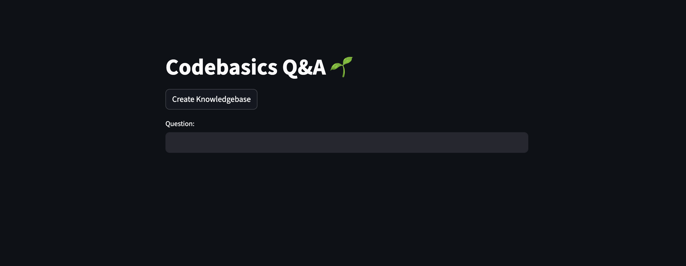
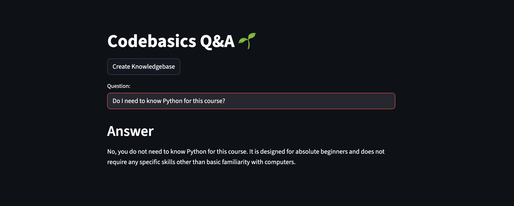
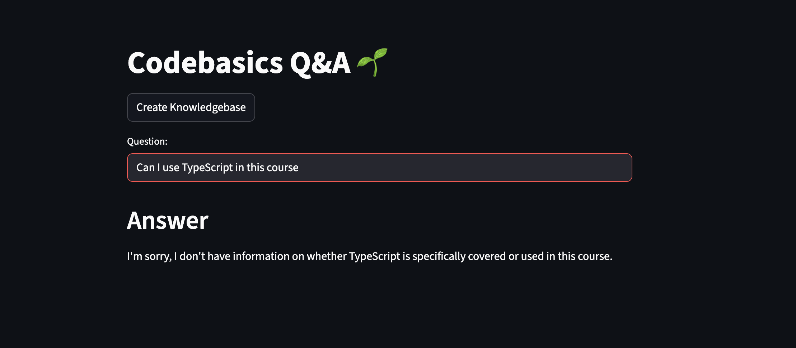

# Codebasics Q&A 🌱

A simple Retrieval-Augmented Generation (RAG) project that answers questions using a custom knowledge base built from Codebasics FAQs.

This project uses LangChain, FAISS, HuggingFace embeddings, and OpenAI to retrieve relevant context and generate accurate answers.

---

## How it Works

1. FAQs are loaded from a CSV file
2. Each entry is converted into embeddings using Instructor embeddings
3. Embeddings are stored locally using FAISS
4. User questions retrieve relevant context
5. An LLM generates an answer grounded in the retrieved data

---

## Tech Stack

- Python
- LangChain
- OpenAI (`gpt-4o`)
- FAISS
- HuggingFace Instructor Embeddings

---

## Demo

### Home Screen


### Question Answering Example (Python)


### Question Answering Example (TypeScript)


---

## Setup

### 1. Clone the repository
```bash
git clone https://github.com/your-username/codebasics-qa.git
cd codebasics-qa


