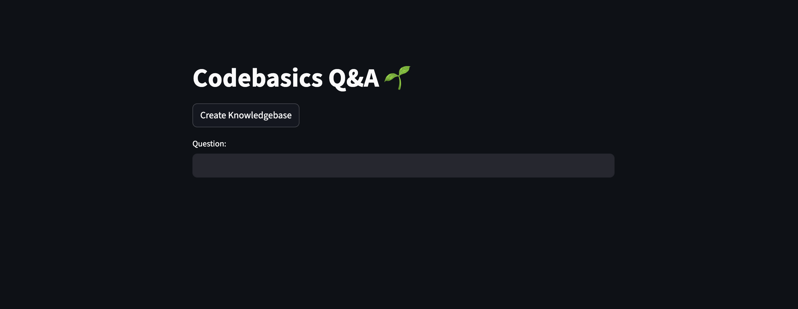
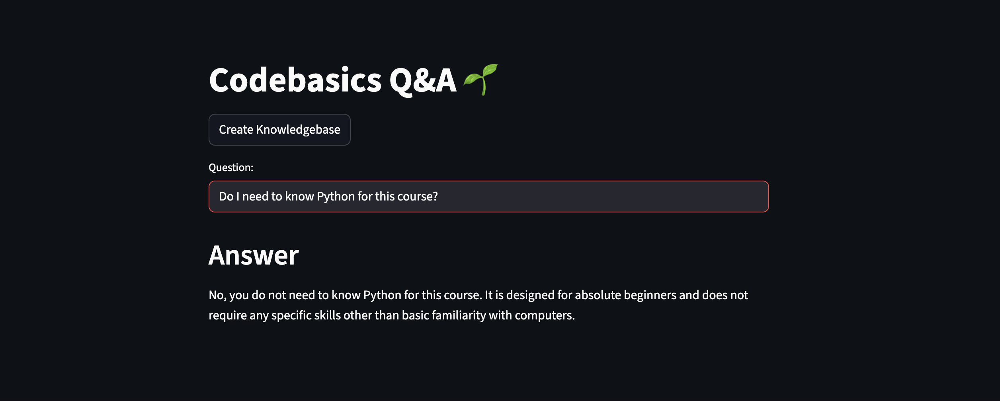
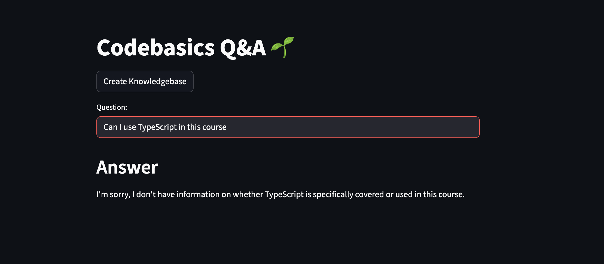

# RAG FAQ Assistant

Retrieval-augmented QA system using FAISS, LangChain, Instructor embeddings, and OpenAI.

This is a retrieval-augmented question-answering system that answers user queries using a domain-specific FAQ knowledge base. It uses semantic retrieval over embedded FAQ entries and generates grounded answers with an LLM. The goal is not to simulate open-ended conversation, but to improve reliability for FAQ-style questions by retrieving relevant context first and constraining generation to that evidence.

## Problem

General-purpose chatbots can sound confident even when they are missing domain-specific context. That makes them a poor fit for FAQ workflows where users expect direct, grounded answers tied to a known source of truth.

This project addresses that problem by pairing retrieval and generation. Instead of asking the model to answer from memory alone, it first searches a local knowledge base of Codebasics FAQ entries and then uses the retrieved context to produce a more reliable response.

## What It Does

- loads a domain-specific FAQ corpus from `codebasics_faqs.csv`
- converts FAQ entries into dense vector embeddings using Instructor embeddings
- stores and queries those embeddings with FAISS
- retrieves semantically relevant FAQ entries for each question
- generates an answer with OpenAI using a prompt that discourages unsupported claims
- displays both the final answer and the retrieved supporting context in the Streamlit UI

## Architecture

High-level flow:

1. Ingestion: the app reads the FAQ CSV and creates LangChain documents.
2. Embedding: each FAQ entry is embedded with `hkunlp/instructor-large`.
3. Indexing: embeddings are stored in a local FAISS index.
4. Retrieval: the retriever selects the most relevant chunks for an incoming question.
5. Generation: `gpt-4o` answers using only the retrieved context.
6. Presentation: Streamlit renders the answer and the supporting source chunks.

Runtime notes:

- `faiss_index/` is treated as a generated artifact and is not meant to be versioned.
- If the local FAISS index does not exist, the application generates it automatically at runtime.
- The notebook is included as exploratory work, but the primary application path is the Streamlit app in `main.py`.

## Tech Stack

- Python
- Streamlit
- LangChain
- OpenAI `gpt-4o`
- FAISS
- Hugging Face Instructor embeddings via `hkunlp/instructor-large`
- `python-dotenv`

## Repository Structure

```text
.
├── README.md
├── requirements.txt
├── .env.example
├── main.py
├── langchain_helper.py
├── codebasics_faqs.csv
├── screenshots/
│   ├── ss-1.png
│   ├── ss-2.png
│   └── ss-3.png
└── question_answering.ipynb
```

File roles:

- `main.py`: Streamlit interface and user interaction flow
- `langchain_helper.py`: vector store creation, retrieval, and QA chain configuration
- `codebasics_faqs.csv`: domain-specific FAQ knowledge base
- `question_answering.ipynb`: exploratory notebook, kept secondary to the application code

## Demo / Screenshots

### Home Screen


### Answering a Python Question


### Answering a TypeScript Question


## How to Run

### 1. Clone the repository

```bash
git clone https://github.com/ketaki99/RAG-Question-Answering.git
cd RAG-Question-Answering
```

### 2. Create and activate a virtual environment

macOS / Linux:

```bash
python3 -m venv .venv
source .venv/bin/activate
```

Windows PowerShell:

```powershell
py -m venv .venv
.venv\Scripts\Activate.ps1
```

Recommended environment:

- Python 3.9 or newer
- internet access on first run so the Instructor embedding model can be downloaded from Hugging Face

### 3. Install dependencies

```bash
pip install -r requirements.txt
```

### 4. Configure environment variables

```bash
cp .env.example .env
```

Windows PowerShell:

```powershell
Copy-Item .env.example .env
```

Then add your OpenAI API key to `.env`:

```bash
OPENAI_API_KEY=your_openai_api_key_here
```

### 5. Run the Streamlit app

```bash
streamlit run main.py
```

On the first run, the app may take longer to start because it needs to download the `hkunlp/instructor-large` embedding model if it is not already cached locally.

The FAISS index is generated locally if `faiss_index/` does not already exist. You can also regenerate it from the UI using the `Rebuild knowledge base` button.

## Design Choices and Tradeoffs

Why retrieval before generation improves grounding:

- Retrieval narrows the model's working context to documents that are relevant to the user query.
- That reduces the chance of unsupported answers compared with prompting the model without evidence.
- It also makes the system more explainable because the UI can surface the source chunks used for the answer.

Why FAISS was chosen:

- FAISS is lightweight, fast, and well suited to local semantic search for a small-to-medium corpus.
- It keeps the project easy to run without requiring an external vector database service.
- The tradeoff is that it is not a full production retrieval platform for multi-tenant or highly dynamic workloads.

Why Instructor embeddings were chosen:

- Instructor embeddings are strong for instruction-aware semantic retrieval tasks.
- They typically perform better than simpler baseline embeddings on intent-sensitive FAQ matching.
- The tradeoff is higher model size and heavier local dependency cost.

Additional tradeoffs:

- The current retrieval flow is intentionally simple and readable, which helps clarity but leaves room for stronger ranking and evaluation.
- The application optimizes for grounded answers over conversational breadth, so it may decline to answer if the retrieved context is weak.
- The corpus is a flat CSV file, which keeps ingestion simple but limits document structure and metadata richness.

## Limitations

- answer quality is bounded by the coverage and quality of the FAQ dataset
- the retriever uses a simple thresholded similarity search without reranking
- there is no automated evaluation suite yet for retrieval accuracy or groundedness
- citations are shown as retrieved chunks rather than polished source references
- the app is optimized for local demonstration, not deployment, authentication, logging, or monitoring

## Future Improvements

- add retrieval and answer-quality evaluation metrics
- introduce metadata-aware retrieval and reranking
- split ingestion, indexing, and serving into clearer workflows or commands
- improve source attribution formatting in the UI
- add dependency pinning and containerization for reproducible deployment
- support larger or more varied document sources beyond a single FAQ CSV

## Why This Project Matters

This project demonstrates more than API wiring. It shows how to turn a language model into a narrower, more trustworthy system by adding retrieval, local indexing, prompt constraints, and transparent source display. For recruiters and hiring managers, that makes it a better signal of engineering judgment than a generic chatbot demo because it reflects system design choices, tradeoff awareness, and a practical approach to improving answer reliability.
